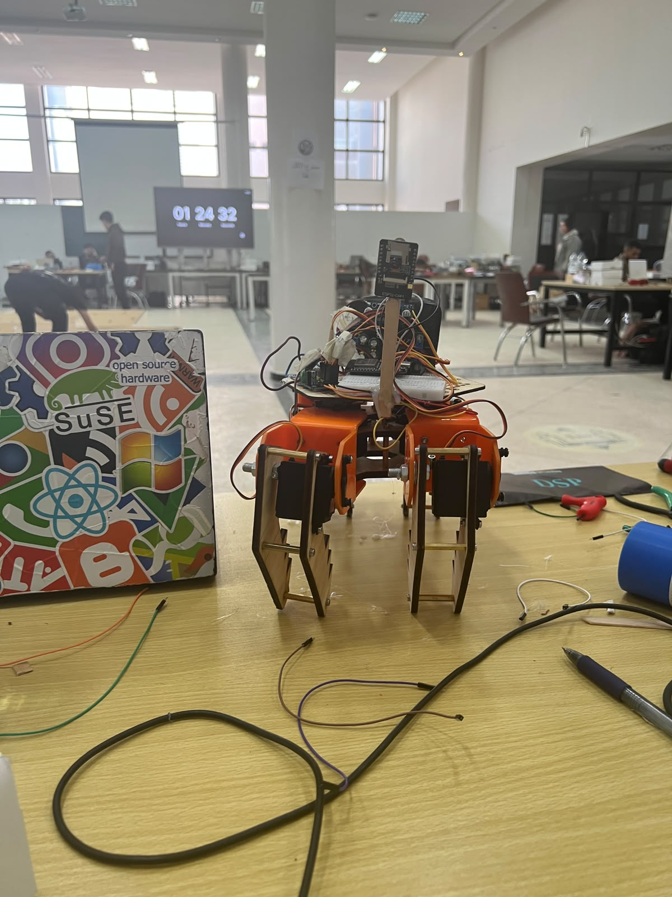

# PS5-controlled quadruped with color and ArUco vision



*Physical prototype during development.*

A four-legged robot prototype using an ESP32, a PCA9685 servo driver, and a PS5 controller. An ESP32-CAM streams video over HTTP to a Python detector, which identifies colored cubes/cylinders and ArUco markers. The detector can also use a laptop webcam.

The two controller sketches were variants of the same firmware. The main sketch uses GPIO 16/17 for UART; the earlier debug variant is retained under `firmware/archive` for reference.

## What the code does

| Component | Function |
| --- | --- |
| [`firmware/spider_controller/spider_controller.ino`](firmware/spider_controller/spider_controller.ino) | Drives eight servos through a PCA9685; PS5 D-pad commands walking and turning, right stick commands in-place spin, Circle triggers a wave. X toggles a UART `START_AI`/`STOP_AI` message and an LED. |
| [`vision/detector_laptop.py`](vision/detector_laptop.py) | Reads a laptop webcam or HTTP video stream; uses HSV masks and contours to label colored shapes; detects ArUco markers and treats each marker ID as the quantity of the nearest shape. Shows a live overlay and a total. |
| [`firmware/archive/spider_controller_debug.ino`](firmware/archive/spider_controller_debug.ino) | Earlier debug variant. Its GPIO 34/35 UART assignment is unsuitable for transmit on a standard ESP32, so use the main sketch for hardware work. |

The ESP32-CAM firmware **streams video over HTTP**, but its source was not supplied for this repository. The Python detector reads that stream locally. The ESP32 robot controller is a separate program. Its `START_AI`/`STOP_AI` and `DET:` UART paths are present in the sketch, but the supplied camera behavior does not implement that UART protocol. The Python program prints detections locally and does not send movement commands to the robot.

## Hardware and wiring

- ESP32 development board
- PCA9685 16-channel PWM board
- Four hip servos and four knee servos on channels 0–7
- PS5 controller paired with the ESP32 Bluetooth host address
- ESP32-CAM running an HTTP video stream (or a laptop webcam)
- Optional LED on GPIO 27

| ESP32 pin | Connection |
| --- | --- |
| GPIO 21 | PCA9685 SDA |
| GPIO 22 | PCA9685 SCL |
| GPIO 16 (RX2) | UART receive hook in the sketch; unused by the HTTP stream |
| GPIO 17 (TX2) | UART transmit hook in the sketch; unused by the HTTP stream |
| GPIO 27 | Mode indicator LED |

Use a suitable external supply for the servos, and connect grounds between the ESP32, PCA9685, and servo supply. The HTTP camera and laptop must be on a network where the stream URL is reachable. Check servo polarity, travel limits, and mechanical clearance before powering the robot. The servo pulse range and gait angles in the sketch are project-specific calibration values.

## Run the laptop detector

Use Python 3.10 or newer and a connected camera:

```powershell
python -m venv .venv
.venv\Scripts\python -m pip install -r vision\requirements.txt
.venv\Scripts\python vision\detector_laptop.py --camera 0
.venv\Scripts\python vision\detector_laptop.py --stream-url http://CAMERA_IP:81/stream
```

Use the actual HTTP video endpoint exposed by your ESP32-CAM firmware; `:81/stream` is an example used by some camera sketches. Press `q` in the video window to quit. Change `--camera` to `1` or another index if needed. Install the GUI-enabled `opencv-contrib-python` package listed in the requirements; the ArUco module is used by the script. The HSV thresholds and `MIN_AREA` constant may need tuning for your lighting and camera distance.

The detector assumes the printed marker **ID encodes quantity**. For example, marker ID 3 is displayed as `3x` the nearest detected shape. Marker dictionaries in the source are 4×4 50, 5×5 100, and ArUco Original. Nearest-shape pairing has no maximum-distance gate, so review results when multiple objects are close together.

## Build the ESP32 controller

1. Install ESP32 board support, `Adafruit_PWMServoDriver`, and a compatible `ps5Controller` library in your Arduino environment.
2. Copy `firmware/spider_controller/controller_config.example.h` to `firmware/spider_controller/controller_config.h` and set `PS5_HOST_MAC` for your pairing setup. This local file is git-ignored.
3. Select your ESP32 board and flash `firmware/spider_controller/spider_controller.ino`.
4. Open Serial Monitor at 115200 baud, pair the controller, and check the servos with the robot supported off the ground first.

The sketch waits in `setup()` until a PS5 controller connects. The robot firmware and servo movement have not been compiled or tested against physical hardware as part of this repository packaging.

## Verification

The Python detector has synthetic-image tests for basic shape and ArUco recognition:

```powershell
.venv\Scripts\python -m unittest discover -s tests -v
```

These tests do not validate a live HTTP stream, servo calibration, or PS5 pairing.
